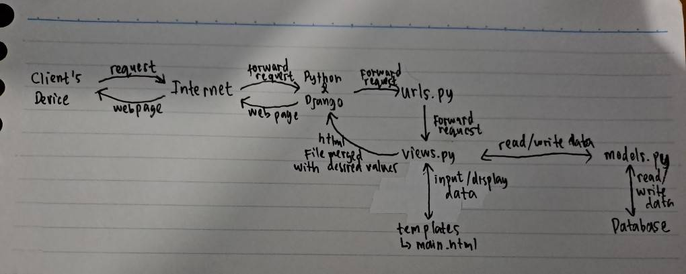

# Arto Moro Page
#### by Rakha Abid Bangsawan - 2206081585 - PBP A
<hr>

## 1. Jelaskan bagaimana cara kamu mengimplementasikan checklist di atas secara step-by-step (bukan hanya sekadar mengikuti tutorial).

### Cara Pengerjaan Checklist
- [ ] Membuat sebuah proyek Django baru. <br>
    - Membuat directory baru bernama `arto_moro_pbp` yang akan dijadikan local directory/repository dari github repository
    - Membuka CMD pada directory `arto_moro_pbp` dan menjalankan `git init`,  `git config user.name <user_name>`, dan `git config user.email <user_email` untuk konfigurasi github
    - Membuat reporitory github baru bernama `arto-moro-pbp`
    - Membuat file `README.md` dan mengeditnya melalui VSCODE
    - Menjalankan `git branch -M main`, `git remote add origin https://github.com/rakbidb/arto-moro-pbp.git`, dan `git push -u origin main` untuk membuat main branch dengan nama `main`, menghubungkan local directory/repository dengan repository github, dan push/update semua perubahan ke github
    - Menjalankan `python -m venv env` untuk membuat virtual environment untuk directory agar dapat maintain versi-versi django dan lain sebagainya yang dipakai di device
    - Menjalankan `env\Scripts\activate.bat` untuk mengaktifkan virtual environment
    - Membuat file baru bernama `requirements.txt` dan mengisinya dengan hal-hal yang ingin diinstall agar tidak terlalu banyak menjalankan command `pip install ...`, saya mengisinya dengan:
    ```bash
    django
    gunicorn
    whitenoise
    psycopg2-binary
    requests
    urllib3
    ```
    - Menjalankan `pip install -r requirements.txt` untuk install hal-hal yang telah ditambahkan pada `requirements.txt` tadi
    - Menjalankan `django-admin startproject arto_moro_pbp .`
    - Membuka file `settings.py` dan ubah `ALLOWED_HOSTS = []` menjadi `ALLOWED_HOSTS = ["*"]` karena akan diperlukan untuk proses deployment 
    - Membuat file baru bernama `.gitignore` untuk memberikan informasi mengenai berkas yang perubahannya tidak perlu ditrack oleh Git, saya mengisinya dengan:
    ```bash
    # Django
    *.log
    *.pot
    *.pyc
    __pycache__
    db.sqlite3
    media
    
    # Backup files
    *.bak 
    
    # If you are using PyCharm
    # User-specific stuff
    .idea/**/workspace.xml
    .idea/**/tasks.xml
    .idea/**/usage.statistics.xml
    .idea/**/dictionaries
    .idea/**/shelf
    
    # AWS User-specific
    .idea/**/aws.xml
    
    # Generated files
    .idea/**/contentModel.xml
    
    # Sensitive or high-churn files
    .idea/**/dataSources/
    .idea/**/dataSources.ids
    .idea/**/dataSources.local.xml
    .idea/**/sqlDataSources.xml
    .idea/**/dynamic.xml
    .idea/**/uiDesigner.xml
    .idea/**/dbnavigator.xml
    
    # Gradle
    .idea/**/gradle.xml
    .idea/**/libraries
    
    # File-based project format
    *.iws
    
    # IntelliJ
    out/
    
    # JIRA plugin
    atlassian-ide-plugin.xml
    
    # Python
    *.py[cod] 
    *$py.class 
    
    # Distribution / packaging 
    .Python build/ 
    develop-eggs/ 
    dist/ 
    downloads/ 
    eggs/ 
    .eggs/ 
    lib/ 
    lib64/ 
    parts/ 
    sdist/ 
    var/ 
    wheels/ 
    *.egg-info/ 
    .installed.cfg 
    *.egg 
    *.manifest 
    *.spec 
    
    # Installer logs 
    pip-log.txt 
    pip-delete-this-directory.txt 
    
    # Unit test / coverage reports 
    htmlcov/ 
    .tox/ 
    .coverage 
    .coverage.* 
    .cache 
    .pytest_cache/ 
    nosetests.xml 
    coverage.xml 
    *.cover 
    .hypothesis/ 
    
    # Jupyter Notebook 
    .ipynb_checkpoints 
    
    # pyenv 
    .python-version 
    
    # celery 
    celerybeat-schedule.* 
    
    # SageMath parsed files 
    *.sage.py 
    
    # Environments 
    .env 
    .venv 
    env/ 
    venv/ 
    ENV/ 
    env.bak/ 
    venv.bak/ 
    
    # mkdocs documentation 
    /site 
    
    # mypy 
    .mypy_cache/ 
    
    # Sublime Text
    *.tmlanguage.cache 
    *.tmPreferences.cache 
    *.stTheme.cache 
    *.sublime-workspace 
    *.sublime-project 
    
    # sftp configuration file 
    sftp-config.json 
    
    # Package control specific files Package 
    Control.last-run 
    Control.ca-list 
    Control.ca-bundle 
    Control.system-ca-bundle 
    GitHub.sublime-settings 
    
    # Visual Studio Code
    .vscode/* 
    !.vscode/settings.json 
    !.vscode/tasks.json 
    !.vscode/launch.json 
    !.vscode/extensions.json 
    .history
    ```
    <hr>

- [ ] Membuat aplikasi dengan nama `main` pada proyek tersebut.<br>
    - Masih pada CMD yang sama, jalankan `python manage.py startapp main` untuk membuat django app baru bernama `main` pada django project bernama `arto_moro_pbp`
    - Membuka file `settings.py` dan tambahkan `'main'` pada variabel `INSTALLED_APPS`
    - Membuka directory `main` dan buat directory baru bernama `templates` untuk menyimpan file `.html` yang akan digunakan karena django menggunakan Model-View-Template (MVT) 
    - Membuat file baru bernama `main.html` pada directory `templates` dan mengisinya dengan konten-konten yang diperlukan. Untuk Tugas 2, yang wajib muncul adalah nama aplikasi, nama, dan kelas. 
    <hr>

- [ ] Melakukan *routing* pada proyek agar dapat menjalankan aplikasi `main`. <br>
    - Membuka file `urls.py` pada directory `arto_moro_pbp`
    - Menambahkan `from django.urls import path, include`
    - Mengubah `urlpatterns` menjadi:
    ```bash
    urlpatterns = [
    path('admin/', admin.site.urls),
    path('main/', include('main.urls')),
    ]
    ```
    Note:
    - `path('main/', include('main.urls')),` digunakan untuk menambahkan routing dari `urls.py` pada directory `main` dan url yang ada pada `urls.py` di `main` akan menjadi `.../main/...`
    <hr>

- [ ] Membuat model pada aplikasi `main` dengan nama `Item` dan memiliki atribut wajib sebagai berikut.
    - `name` sebagai nama *item* dengan tipe `CharField`.
    - `amount` sebagai jumlah *item* dengan tipe `IntegerField`.
    - `description` sebagai deskripsi *item* dengan tipe `TextField`.
    Namun, saya juga menambahkan beberapa atribut sehingga atribut yang saya miliki sebagai berikut.
    - `name` sebagai nama *item* dengan tipe `CharField`.
    - `date_added` sebagai waktu tanggal dibuatnya *item* dengan tipe `DateField`.
    - `price` sebagai harga *item* dengan tipe `IntegerField`.
    - `description` sebagai deskripsi *item* dengan tipe `TextField`.
    - `amount` sebagai jumlah *item* dengan tipe `IntegerField`.
    - `category` sebagai kategori *item* dengan tipe `TextField`.
    <br>
    
    - Membuka `models.py` dan mengisinya dengan attributes/fields yang diperlukan. Pada kasus ini, saya menggunakan 6 attributes, yakni `name` (CharField), `date_added` (DateField), `price` (IntegerField), `description` (TextField), `amount` (IntegerField), dan `category` (TextField). Isi file `models.py` adalah sebagai berikut:
    ```bash
    from django.db import models

    class Product(models.Model):
        name = models.CharField(max_length=255)
        date_added = models.DateField(auto_now_add=True)
        price = models.IntegerField()
        description = models.TextField()
        amount = models.IntegerField()
        category = models.TextField()
    ```
    <hr>

- [ ] Membuat sebuah fungsi pada `views.py` untuk dikembalikan ke dalam sebuah *template* HTML yang menampilkan nama aplikasi serta nama dan kelas kamu. <br>
    - Membuka `views.py` dan menambahkan potongan kode di bawah ini untuk menghubungkan Views dan Templates (e.g.: substitute `{{ <desired_variable> }}` pada file-file di directory `templates`). Saya memerlukan variables `name`, `class`, `app_name`. Jadi, isi `views.py` sebagai berikut:
    ```bash
    from django.shortcuts import render
    from .models import Product

    def show_main(request):
        context = {
            'name': 'Rakha Abid Bangsawan',
            'class': 'PBP A',
            'app_name': 'Arto Moro PBP',
        }

        return render(request, "main.html", context)
    ```
    <hr>

- [ ] Membuat sebuah *routing* pada `urls.py` aplikasi `main` untuk memetakan fungsi yang telah dibuat pada `views.py`. <br>
    - ubah `urlpatterns` menjadi seperti ini:
    ```bash
    app_name = 'main'

    urlpatterns = [
        path('', show_main, name='show_main'),
    ]
    ```
    <hr>

- [ ] Melakukan *deployment* ke Adaptable terhadap aplikasi yang sudah dibuat sehingga nantinya dapat diakses oleh teman-temanmu melalui Internet. <br>
    - belum sempat di-deploy
    <hr>

## 2. Buatlah bagan yang berisi request client ke web aplikasi berbasis Django beserta responnya dan jelaskan pada bagan tersebut kaitan antara urls.py, views.py, models.py, dan berkas html

- Client mengirim request ke Internet -> forward ke Python/Django -> forward ke urls.py -> forward ke views.py untuk memproses url -> read/write data dari/ke models.py dan database -> input/display data dari/ke templates -> return html file yang telah dimerge dengan value-value yang diinginkan -> proses ke internet -> display ke client's device
<hr>

## 3. Jelaskan mengapa kita menggunakan virtual environment? Apakah kita tetap dapat membuat aplikasi web berbasis Django tanpa menggunakan virtual environment?
Virtual Environment adalah suatu alat yang digunakan sebagai wadah untuk mengenkapsulasi serta menampung package atau library agar tetap terisolasi. Virtual Environment dibutuhkan dan berperan penting dalam pembuatan aplikasi web untuk mencegah adanya issues dependency yang dapat terjadi akibat adanya pembaruan perbedaan versi pada external library dari project yang satu dengan yang lainnya. Jika kita tidak menggunakan virtual environment, maka kita tidak dapat bekerja menggunakan dua library dengan versi yang berbeda. Akan tetapi, kita dapat membuat aplikasi web berbasis Django tanpa virtual environment ketika sedang mengerjakan project secara individu bukan secara tim karena jika mengerjakan secara tim tanpa environment akan sulit apabila masing-masing anggota memiliki versi modul yang berbeda-beda
<hr>

## 4. Jelaskan apakah itu MVC, MVT, MVVM dan perbedaan dari ketiganya.
- <b>MVC (Model-View-Controller)</b>
    - Model: untuk mencari dan mengolah data yang diminta oleh Database
    - View: menampilkan data dengan design yang dibuat di sini (kurang lebih seperti Template pada MVT dan View pada MVVM)
    - Controller: mengatur bagaimana data akan ditampilkan di View (kurang lebih seperti View pada MVT)
    - Input diterima oleh Controller
    - Kurang cocok untuk aplikasi berskala kecil
- <b>MVT/MTV (Model-View-Template)</b>
    - Model: untuk mencari dan mengolah data yang diminta oleh database
    - View: mengatur bagaimana data akan ditampilkan di Template (kurang lebih seperti Controller pada MVC)
    - Template: menampilkan data dengan design yang dibuat di sini (kurang lebih seperti View pada MVC dan MVVM)
    - Input diterima oleh View
    - Cocok digunakan baik untuk aplikasi berskala besar maupun kecil
    - Mudah melakukan modifikasi
- <b>MVVM (Model-View-ViewModel)</b>
    - Model: tempat untuk menyimpan informasi
    - View: menampilkan data dengan design yang dibuat di sini (kurang lebih seperti View pada MVC dan Template pada MVVM)
    - ViewModel: menghubungkan Model dan View
    - Input diterima oleh View
    - Kurang cocok untuk palikasi berskala kecil
    - Memiliki kelebihan dalam proses binding data
    <hr>
    
## References
- [Tutorial 0 dan Tutorial 1](https://pbp-fasilkom-ui.github.io/ganjil-2024/docs)
- [Definition Model-View-ViewModel (MVVM)](https://www.techtarget.com/whatis/definition/Model-View-ViewModel)
- [MVC Framework - Introduction](https://www.tutorialspoint.com/mvc_framework/mvc_framework_introduction.htm)
- [Slide 3 SCeLE "MTV Django Architecture"](https://scele.cs.ui.ac.id/pluginfile.php/193781/mod_resource/content/1/03%20-%20MTV%20Django%20Architecture.pdf)
- [Alasan Menggunakan Virtual Environment](https://github.com/alizhasubianto/Tugas2)