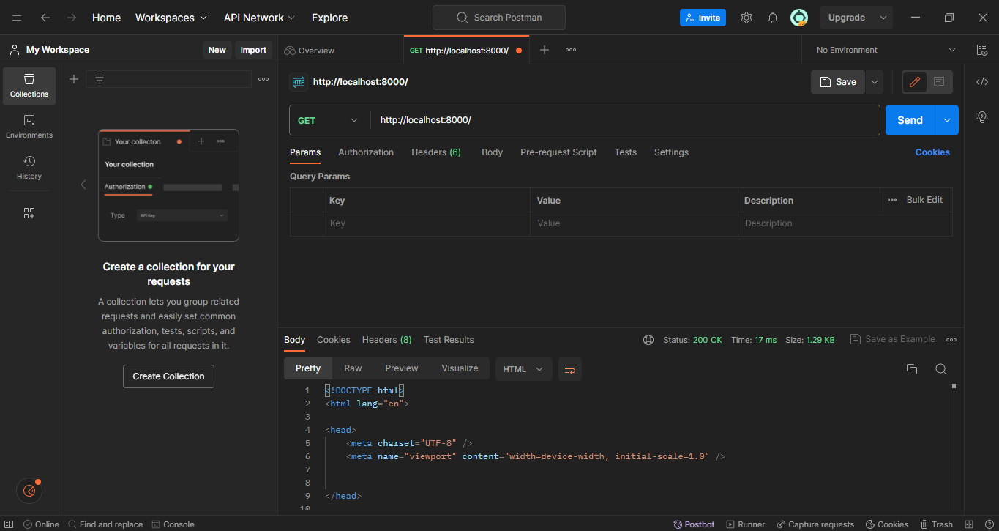
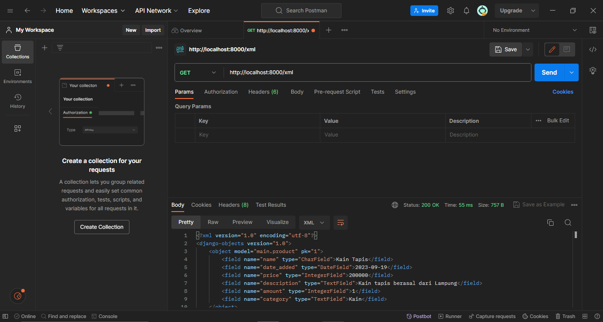
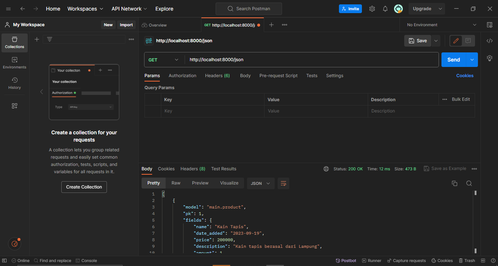
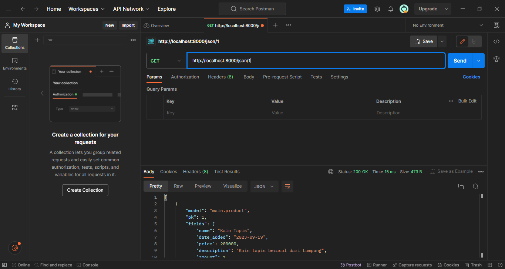

# Arto Moro Page
#### by Rakha Abid Bangsawan - 2206081585 - PBP A
<hr>

# Jawaban Tugas 2
<hr>

## 1. Jelaskan bagaimana cara kamu mengimplementasikan checklist di atas secara step-by-step (bukan hanya sekadar mengikuti tutorial).

### Cara Pengerjaan Checklist
- [ ] Membuat sebuah proyek Django baru. <br>
    - Membuat directory baru bernama `arto_moro_pbp` yang akan dijadikan local directory/repository dari github repository
    - Membuka CMD pada directory `arto_moro_pbp` dan menjalankan `git init`,  `git config user.name <user_name>`, dan `git config user.email <user_email` untuk konfigurasi github
    - Membuat reporitory github baru bernama `arto-moro-pbp`
    - Membuat file `README.md` dan mengeditnya melalui VSCODE
    - Menjalankan `git branch -M main`, `git remote add origin https://github.com/rakbidb/arto-moro-pbp.git`, dan `git push -u origin main` untuk membuat main branch dengan nama `main`, menghubungkan local directory/repository dengan repository github, dan push/update semua perubahan ke github
    - Menjalankan `python -m venv env` untuk membuat virtual environment untuk directory agar dapat maintain versi-versi django dan lain sebagainya yang dipakai di device
    - Menjalankan `env\Scripts\activate.bat` untuk mengaktifkan virtual environment
    - Membuat file baru bernama `requirements.txt` dan mengisinya dengan hal-hal yang ingin diinstall agar tidak terlalu banyak menjalankan command `pip install ...`, saya mengisinya dengan:
    ```bash
    django
    gunicorn
    whitenoise
    psycopg2-binary
    requests
    urllib3
    ```
    - Menjalankan `pip install -r requirements.txt` untuk install hal-hal yang telah ditambahkan pada `requirements.txt` tadi
    - Menjalankan `django-admin startproject arto_moro_pbp .`
    - Membuka file `settings.py` dan ubah `ALLOWED_HOSTS = []` menjadi `ALLOWED_HOSTS = ["*"]` karena akan diperlukan untuk proses deployment 
    - Membuat file baru bernama `.gitignore` untuk memberikan informasi mengenai berkas yang perubahannya tidak perlu ditrack oleh Git, saya mengisinya dengan:
    ```bash
    # Django
    *.log
    *.pot
    *.pyc
    __pycache__
    db.sqlite3
    media
    
    # Backup files
    *.bak 
    
    # If you are using PyCharm
    # User-specific stuff
    .idea/**/workspace.xml
    .idea/**/tasks.xml
    .idea/**/usage.statistics.xml
    .idea/**/dictionaries
    .idea/**/shelf
    
    # AWS User-specific
    .idea/**/aws.xml
    
    # Generated files
    .idea/**/contentModel.xml
    
    # Sensitive or high-churn files
    .idea/**/dataSources/
    .idea/**/dataSources.ids
    .idea/**/dataSources.local.xml
    .idea/**/sqlDataSources.xml
    .idea/**/dynamic.xml
    .idea/**/uiDesigner.xml
    .idea/**/dbnavigator.xml
    
    # Gradle
    .idea/**/gradle.xml
    .idea/**/libraries
    
    # File-based project format
    *.iws
    
    # IntelliJ
    out/
    
    # JIRA plugin
    atlassian-ide-plugin.xml
    
    # Python
    *.py[cod] 
    *$py.class 
    
    # Distribution / packaging 
    .Python build/ 
    develop-eggs/ 
    dist/ 
    downloads/ 
    eggs/ 
    .eggs/ 
    lib/ 
    lib64/ 
    parts/ 
    sdist/ 
    var/ 
    wheels/ 
    *.egg-info/ 
    .installed.cfg 
    *.egg 
    *.manifest 
    *.spec 
    
    # Installer logs 
    pip-log.txt 
    pip-delete-this-directory.txt 
    
    # Unit test / coverage reports 
    htmlcov/ 
    .tox/ 
    .coverage 
    .coverage.* 
    .cache 
    .pytest_cache/ 
    nosetests.xml 
    coverage.xml 
    *.cover 
    .hypothesis/ 
    
    # Jupyter Notebook 
    .ipynb_checkpoints 
    
    # pyenv 
    .python-version 
    
    # celery 
    celerybeat-schedule.* 
    
    # SageMath parsed files 
    *.sage.py 
    
    # Environments 
    .env 
    .venv 
    env/ 
    venv/ 
    ENV/ 
    env.bak/ 
    venv.bak/ 
    
    # mkdocs documentation 
    /site 
    
    # mypy 
    .mypy_cache/ 
    
    # Sublime Text
    *.tmlanguage.cache 
    *.tmPreferences.cache 
    *.stTheme.cache 
    *.sublime-workspace 
    *.sublime-project 
    
    # sftp configuration file 
    sftp-config.json 
    
    # Package control specific files Package 
    Control.last-run 
    Control.ca-list 
    Control.ca-bundle 
    Control.system-ca-bundle 
    GitHub.sublime-settings 
    
    # Visual Studio Code
    .vscode/* 
    !.vscode/settings.json 
    !.vscode/tasks.json 
    !.vscode/launch.json 
    !.vscode/extensions.json 
    .history
    ```
    <hr>

- [ ] Membuat aplikasi dengan nama `main` pada proyek tersebut.<br>
    - Masih pada CMD yang sama, jalankan `python manage.py startapp main` untuk membuat django app baru bernama `main` pada django project bernama `arto_moro_pbp`
    - Membuka file `settings.py` dan tambahkan `'main'` pada variabel `INSTALLED_APPS`
    - Membuka directory `main` dan buat directory baru bernama `templates` untuk menyimpan file `.html` yang akan digunakan karena django menggunakan Model-View-Template (MVT) 
    - Membuat file baru bernama `main.html` pada directory `templates` dan mengisinya dengan konten-konten yang diperlukan. Untuk Tugas 2, yang wajib muncul adalah nama aplikasi, nama, dan kelas. 
    <hr>

- [ ] Melakukan *routing* pada proyek agar dapat menjalankan aplikasi `main`. <br>
    - Membuka file `urls.py` pada directory `arto_moro_pbp`
    - Menambahkan `from django.urls import path, include`
    - Mengubah `urlpatterns` menjadi:
    ```bash
    urlpatterns = [
    path('admin/', admin.site.urls),
    path('main/', include('main.urls')),
    ]
    ```
    Note:
    - `path('main/', include('main.urls')),` digunakan untuk menambahkan routing dari `urls.py` pada directory `main` dan url yang ada pada `urls.py` di `main` akan menjadi `.../main/...`
    <hr>

- [ ] Membuat model pada aplikasi `main` dengan nama `Item` dan memiliki atribut wajib sebagai berikut.
    - `name` sebagai nama *item* dengan tipe `CharField`.
    - `amount` sebagai jumlah *item* dengan tipe `IntegerField`.
    - `description` sebagai deskripsi *item* dengan tipe `TextField`.
    Namun, saya juga menambahkan beberapa atribut sehingga atribut yang saya miliki sebagai berikut.
    - `name` sebagai nama *item* dengan tipe `CharField`.
    - `date_added` sebagai waktu tanggal dibuatnya *item* dengan tipe `DateField`.
    - `price` sebagai harga *item* dengan tipe `IntegerField`.
    - `description` sebagai deskripsi *item* dengan tipe `TextField`.
    - `amount` sebagai jumlah *item* dengan tipe `IntegerField`.
    - `category` sebagai kategori *item* dengan tipe `TextField`.
    <br>
    
    - Membuka `models.py` dan mengisinya dengan attributes/fields yang diperlukan. Pada kasus ini, saya menggunakan 6 attributes, yakni `name` (CharField), `date_added` (DateField), `price` (IntegerField), `description` (TextField), `amount` (IntegerField), dan `category` (TextField). Isi file `models.py` adalah sebagai berikut:
    ```bash
    from django.db import models

    class Product(models.Model):
        name = models.CharField(max_length=255)
        date_added = models.DateField(auto_now_add=True)
        price = models.IntegerField()
        description = models.TextField()
        amount = models.IntegerField()
        category = models.TextField()
    ```
    <hr>

- [ ] Membuat sebuah fungsi pada `views.py` untuk dikembalikan ke dalam sebuah *template* HTML yang menampilkan nama aplikasi serta nama dan kelas kamu. <br>
    - Membuka `views.py` dan menambahkan potongan kode di bawah ini untuk menghubungkan Views dan Templates (e.g.: substitute `{{ <desired_variable> }}` pada file-file di directory `templates`). Saya memerlukan variables `name`, `class`, `app_name`. Jadi, isi `views.py` sebagai berikut:
    ```bash
    from django.shortcuts import render
    from .models import Product

    def show_main(request):
        context = {
            'name': 'Rakha Abid Bangsawan',
            'class': 'PBP A',
            'app_name': 'Arto Moro PBP',
        }

        return render(request, "main.html", context)
    ```
    <hr>

- [ ] Membuat sebuah *routing* pada `urls.py` aplikasi `main` untuk memetakan fungsi yang telah dibuat pada `views.py`. <br>
    - ubah `urlpatterns` menjadi seperti ini:
    ```bash
    app_name = 'main'

    urlpatterns = [
        path('', show_main, name='show_main'),
    ]
    ```
    <hr>

- [ ] Melakukan *deployment* ke Adaptable terhadap aplikasi yang sudah dibuat sehingga nantinya dapat diakses oleh teman-temanmu melalui Internet. <br>
    - belum sempat di-deploy
    <hr>

## 2. Buatlah bagan yang berisi request client ke web aplikasi berbasis Django beserta responnya dan jelaskan pada bagan tersebut kaitan antara urls.py, views.py, models.py, dan berkas html

- Client mengirim request ke Internet -> forward ke Python/Django -> forward ke urls.py -> forward ke views.py untuk memproses url -> read/write data dari/ke models.py dan database -> input/display data dari/ke templates -> return html file yang telah dimerge dengan value-value yang diinginkan -> proses ke internet -> display ke client's device
<hr>

## 3. Jelaskan mengapa kita menggunakan virtual environment? Apakah kita tetap dapat membuat aplikasi web berbasis Django tanpa menggunakan virtual environment?
Virtual Environment adalah suatu alat yang digunakan sebagai wadah untuk mengenkapsulasi serta menampung package atau library agar tetap terisolasi. Virtual Environment dibutuhkan dan berperan penting dalam pembuatan aplikasi web untuk mencegah adanya issues dependency yang dapat terjadi akibat adanya pembaruan perbedaan versi pada external library dari project yang satu dengan yang lainnya. Jika kita tidak menggunakan virtual environment, maka kita tidak dapat bekerja menggunakan dua library dengan versi yang berbeda. Akan tetapi, kita dapat membuat aplikasi web berbasis Django tanpa virtual environment ketika sedang mengerjakan project secara individu bukan secara tim karena jika mengerjakan secara tim tanpa environment akan sulit apabila masing-masing anggota memiliki versi modul yang berbeda-beda
<hr>

## 4. Jelaskan apakah itu MVC, MVT, MVVM dan perbedaan dari ketiganya.
- <b>MVC (Model-View-Controller)</b>
    - Model: untuk mencari dan mengolah data yang diminta oleh Database
    - View: menampilkan data dengan design yang dibuat di sini (kurang lebih seperti Template pada MVT dan View pada MVVM)
    - Controller: mengatur bagaimana data akan ditampilkan di View (kurang lebih seperti View pada MVT)
    - Input diterima oleh Controller
    - Kurang cocok untuk aplikasi berskala kecil
- <b>MVT/MTV (Model-View-Template)</b>
    - Model: untuk mencari dan mengolah data yang diminta oleh database
    - View: mengatur bagaimana data akan ditampilkan di Template (kurang lebih seperti Controller pada MVC)
    - Template: menampilkan data dengan design yang dibuat di sini (kurang lebih seperti View pada MVC dan MVVM)
    - Input diterima oleh View
    - Cocok digunakan baik untuk aplikasi berskala besar maupun kecil
    - Mudah melakukan modifikasi
- <b>MVVM (Model-View-ViewModel)</b>
    - Model: tempat untuk menyimpan informasi
    - View: menampilkan data dengan design yang dibuat di sini (kurang lebih seperti View pada MVC dan Template pada MVVM)
    - ViewModel: menghubungkan Model dan View
    - Input diterima oleh View
    - Kurang cocok untuk palikasi berskala kecil
    - Memiliki kelebihan dalam proses binding data
    <hr>
    
## REFERENSI
- [Tutorial 0 dan Tutorial 1](https://pbp-fasilkom-ui.github.io/ganjil-2024/docs)
- [Definition Model-View-ViewModel (MVVM)](https://www.techtarget.com/whatis/definition/Model-View-ViewModel)
- [MVC Framework - Introduction](https://www.tutorialspoint.com/mvc_framework/mvc_framework_introduction.htm)
- [Slide 3 SCeLE "MTV Django Architecture"](https://scele.cs.ui.ac.id/pluginfile.php/193781/mod_resource/content/1/03%20-%20MTV%20Django%20Architecture.pdf)
- [Alasan Menggunakan Virtual Environment](https://github.com/alizhasubianto/Tugas2)

<hr>

# Jawaban Tugas 3
<hr>

## 1. Apa perbedaan antara form `POST` dan form `GET` dalam Django?
- <b>POST</b>
    - Digunakan untuk mengirimkan data ke server (membuat, mengganti, menghapus, etc.), return HTTP status code 201 jika berhasil
    - Values tidak visible pada URL (data dikirimkan saat HTML request)
    - Tidak memiliki limitasi panjang karakter
    - Dapat menggunakan berbagai tipe data (contoh: string, integer)
    - Lebih secured karena data tidak terekspos pada URL
    - Dapat digunakan untuk mengirimkan data penting (contoh: password)
    - Parameter tidak disimpan pada history browser
    - Non-idempotent
- <b>GET</b>
    - Digunakan untuk membaca/mengakses data dari web server, retrun HTTP status code 200 jika berhasil
    - Values visible pada URL --> user dapat input nilai variabel baru dengan lebih mudah
    - Panjang karakter terbatas (umumnya maksimal 255 karakter)
    - Hanya dapat menggunakan tipe data string
    - Kurang aman karena data terekspos pada URL
    - Dapat digunakan untuk mengirimkan data yang tidak terlalu penting
    - Parameter disimpan pada history browser
    - Idempotent (request selanjutnya akan diabaikan hingga request yang sedang dijalankan selesai mengirimkan respon)
<hr>

## 2. Apa perbedaan utama antara XML, JSON, dan HTML dalam konteks pengiriman data?
- <b>HTML</b>
    - Menurut saya, kurang human-readable apabila merepresentasikan data menggunakan HTML (apabila dilihat melalui Postman)
    - Secara umum, HTML digunakan untuk membuat struktur, layout, dan konten dari web page yang akan ditampilkan. Untuk data yang bersifat dinamis dapat memanfaatkan tools, seperti XML, JSON, dsb
- <b>XML</b>
    - Menurut saya, human-readable karena strukturnya jelas untuk dibaca. Namun, proses delivery datanya memerlukan waktu lebih lama jika dibandingkan dengan JSON
    - Secara umum, XML digunakan untuk menyimpan dan melakukan transfer/pertukaran data melalui internet, banyak digunakan pada web dan mobile app
    - XML lebih secure jika dibandingkan dengan JSON (JSON lebih vulnerable)
    - Waktu eksekusi tidak secepat JSON
    - Struktur data dapat terlihat dengan sangat jelas karena tag nya dapat di-custom (berbeda dengan HTML). Namun, waktu eksekusi program menjadi lebih lama karena banyak tag
- <b>JSON</b>
    - Menurut saya, human-readable karena JSON menggunakan list dan dictionary python. Proses delivery dengan JSON jauh lebih cepat jika dibandingkan dengan menggunakan XML
    - Secara umum, JSON digunakan untuk menyimpan dan melakukan transfer/pertukaran data antara server dan aplikasi web, banyak digunakan juga pada web dan mobile app
    - JSON lebih compatible terhadap teknologi-teknologi web dan lebih mudah untuk di-maintain oleh web developers jika dibandingkan dengan XML
    - Waktu eksekusi lebih cepat dibandingkan XML
    - Tidak menggunakan tag sehingga lebih ringkas dan bisa merepresentasikan dengan ukuran file yang kecil
<hr>

## 3. Mengapa JSON sering digunakan dalam pertukaran data antara aplikasi web modern?
- Tingkat simplicity dan readability yang tinggi karena karena syntax dan indentasinya yang ringkas
- Memiliki banyak method yang dapat mempercepat proses penyusunan program (contoh: JSON.parse() untuk mengubah JSON string menjadi Object dengan atribut-atributnya)
- Dapat merepresentasikan data dengan ukuran file yang kecil karena syntaxnya ringkas (seperti tidak menggunakan tag, etc.)
- JDapat melakukan transfer/pertukaran data dengan sangat cepat (tidak perlu banyak parse karena syntaxnya juga singkat)
- Sangat compatible dengan berbagai teknologi web, seperti JavaScript dan lain-lain.
- Mendukung tipe data native, seperti numbers, booleans, null, etc.
<hr>

## 4. Jelaskan bagaimana cara kamu mengimplementasikan checklist di atas secara step-by-step (bukan hanya sekadar mengikuti tutorial)!
- [ ] Membuat input `form` untuk menambahkan objek model pada app sebelumnya.
    1. Membuat `base.html` pada root/templates dan mengisinya dengan:
    ```html
    
    <!DOCTYPE html>
    <html lang="en">
        <head>
            <meta charset="UTF-8" />
            <meta
                name="viewport"
                content="width=device-width, initial-scale=1.0"
            />
            
            
        </head>

        <body>
            
            
        </body>
    </html>
    ```
    Note: 
    - `` dapat diisi dari file lain (seperti semacam placeholder)
    2. Membuat `forms.py` pada `arto_moro_pbp/main` dan mengisinya dengan:
    ```python
    from django.forms import ModelForm
    from main.models import Product

    class ProductForm(ModelForm):
        class Meta:
            model = Product
            fields = ["name", "price", "description", "amount", "category"]
    ```
    Notes: 
    - `model = Product` menandakan bahwa isian form akan disimpan sebagai object Product
    - `fields` menandakan bahwa object Product memiliki 5 atribut yang dapat diisi melalui form (name, price, description, amount, category)
    3. Ubah function `show_main` pada `arto_moro_pbp/main/views.py` menjadi sebagai berikut:
    ```python
    def show_main(request):
    products = Product.objects.all()

    context = {
        'name': 'Rakha Abid Bangsawan', # Nama kamu
        'class': 'PBP A', # Kelas PBP kamu
        'app_name': 'Arto Moro PBP',
        'products': products,
        'total_products': products.__len__(),
    }

    return render(request, "main.html", context)
    ```
    Notes:
    - `'products` akan menyimpan seluruh product yang ada pada project saat ini
    - `total_products` akan menyimpan banyak product yang ada pada project saat ini
    4. Buat `create_product.html` pada `arto_moro_pbp/main/templates/` dan isi sebagai berikut:
    ```html
     

    
    <h1>Add New Product</h1>

    <form method="POST">
        
        <table>
            {{ form.as_table }}
            <tr>
                <td></td>
                <td>
                    <input type="submit" value="Add Product"/>
                </td>
            </tr>
        </table>
    </form>

    
    ```
    Notes: 
    - ` ... ` adalah konten yang akan mengisi placeholder block content pada `base.html`.
    - `<form method="POST>` karena user akan memberikan beberapa input.
<hr>

- [ ] Tambahkan 5 fungsi `views` untuk melihat objek yang sudah ditambahkan dalam format HTML, XML, JSON, XML *by ID*, dan JSON *by ID*.
    1. `create_product` untuk menerima input user, dapat diakses ketika user klik button "Add New Product" atau ketika user mengakses `(url)/create-product`
    ```python
    def create_product(request):
        form = ProductForm(request.POST or None)

        if form.is_valid() and request.method == "POST":
            form.save()
            return HttpResponseRedirect(reverse('main:show_main'))

        context = {'form': form}
        return render(request, "create_product.html", context)    
    ```
    2. `show_xml` untuk menampilkan representasi seluruh products dalam format XML, dapat diakses pada `(url)/xml`
    ```python
    def show_xml(request):
        data = Product.objects.all()
        return HttpResponse(serializers.serialize("xml", data), content_type="application/xml")
    ```
    3. `show_json` untuk menampilkan representasi seluruh products dalam format JSON, dapat diakses pada `(url)/json`
    ```python
    def show_json(request):
        data = Product.objects.all()
        return HttpResponse(serializers.serialize("json", data), content_type="application/json")    
    ```
    4. `show_xml_by_id` untuk menampilkan representasi product dengan id yang diinginkan dalam format XML, dapat diakses pada `(url)/xml/(desired_id)`
    ```python
    def show_xml_by_id(request, id):
        data = Product.objects.filter(pk=id)
        return HttpResponse(serializers.serialize("xml", data), content_type="application/xml")    
    ```
    5. `show_json_by_id` untuk menampilkan representasi product dengan id yang diinginkan dalam format JSON, dapat diakses pada `(url)/json/(desired_id)`
    ```python
    def show_json_by_id(request, id):
        data = Product.objects.filter(pk=id)
        return HttpResponse(serializers.serialize("json", data), content_type="application/json")    
    ```
<hr>

- [ ] Membuat routing URL untuk masing-masing `views` yang telah ditambahkan pada poin 2.
    1. Isi `arto_moro_pbp/main/urls.py` dengan:
    ```python
    from django.urls import path
    from main.views import show_main, create_product, show_xml, show_json, show_xml_by_id, show_json_by_id # , show_products

    app_name = 'main'

    urlpatterns = [
        path('', show_main, name='show_main'), 
        path('create-product', create_product, name='create_product'),
        path('xml/', show_xml, name='show_xml'), 
        path('json/', show_json, name='show_json'),
        path('xml/<int:id>/', show_xml_by_id, name='show_xml_by_id'),
        path('json/<int:id>/', show_json_by_id, name='show_json_by_id'), 
    ]
    ```
    `urlpatterns` digunakan agar function-function yang telah dicantumkan pada `views.py` dapat diakses dengan url yang diinginkan, untuk project ini detailnya sebagai berikut:
    - `(url)/create-product`: Untuk user input product baru
    - `(url)/xml`: Untuk menampilkan representasi seluruh products dalam format XML
    - `(url)/json`: Untuk menampilkan representasi seluruh products dalam format JSON
    - `(url)/xml/(desired_id)`: Untuk menampilkan representasi product dengan id yang diinginkan dalam format XML
    - `(url)/xml/(desired_id)`: Untuk menampilkan representasi product dengan id yang diinginkan dalam format JSON
<hr>

### Cara Pengerjaan Bonus:
1. Tambahkan `'total_products': products.__len__(),` pada `arto_moro_pbp/main/views.py` untuk menyimpan bannyaknya jumlah product saat ini.
2. Tambahkan `<h3>Kamu menyimpan {{total_products}} product pada aplikasi Arto Moro PBP!</h3>` pada `arto_moro_pbp/main/templates/main.html` karena banyaknya product saat ini disimpan pada `total_products`.
<hr>

## 5. Mengakses kelima URL di poin 2 menggunakan Postman, membuat screenshot dari hasil akses URL pada Postman, dan menambahkannya ke dalam README.md
1. HTML: `(url)/create-product`: Untuk user input product baru

2. XML: `(url)/xml`: Untuk menampilkan representasi seluruh products dalam format XML

3. JSON: `(url)/json`: Untuk menampilkan representasi seluruh products dalam format JSON

4. XML by ID: `(url)/xml/(desired_id)`: Untuk menampilkan representasi product dengan id yang diinginkan dalam format XML

5. JSON by ID: `(url)/json/(desired_id)`: Untuk menampilkan representasi product dengan id yang diinginkan dalam format JSON

<hr>

## REFERENSI
- [Tutorial 2](https://pbp-fasilkom-ui.github.io/ganjil-2024/docs/tutorial-2)
- [Get vs Post](https://www.javatpoint.com/get-vs-post)
- [Handling an HTML Form – GET and POST Methods, and Data Encoding [Dev Concepts #38]](https://softuni.org/dev-concepts/handling-an-html-form/)
- [Slide 4 - SCeLE "Data Delivery"](https://scele.cs.ui.ac.id/mod/resource/view.php?id=150830)
- [What’s the Relationship Between XML, JSON, HTML and the Internet?](https://www.deltaxml.com/blog/xml/whats-the-relationship-between-xml-json-html-and-the-internet/#:~:text=In%20short%2C%20HTML%20is%20the,is%20really%20no%20practical%20alternative.)
- [What are the advantages and disadvantages of using JSON vs XML?](https://www.linkedin.com/advice/0/what-advantages-disadvantages-using-json-vs-xml#:~:text=Generally%20speaking%2C%20JSON%20is%20more,but%20less%20secure%20than%20XML.)
<hr> 

# Jawaban Tugas 4
<hr>

## 1. Apa itu Django `UserCreationForm`, dan jelaskan apa kelebihan dan kekurangannya?
- `UserCreationForm` merupakan form yang disediakan oleh Django dan dapat digunakan untuk membuat (register) user baru dan user tersebut kemudian dapat login.
- By default, terdiri atas 3 fields, yaitu `username`, `passowrd1`, dan `password2`.
- Kelebihan:
    - Telah disediakan/diimplementasikan oleh Django sehingga kita dapat langsung menggunakannya (tidak perlu membuat from scratch), baik cukup dengan default yang disediakan maupun ingin menambahkan fields custom lain
    - By default, telah memvalidasi input dari user, e.g. `password must be at least 8 characters`, `password can't be entirely numeric`, dll. sehingga kita tidak perlu mengimplementasikan secara manual.
- Kekurangan:
    - Kurang customizable jika perlu menambahkan kustomisasi (e.g. menambahkan fields baru) perlu mengedit beberapa file dan mengimplementasikannya secara manual.
    - Untuk fitur seperti login, logout, dll., tetap ada beberapa hal yang harus diimplementasikan secara manual (tidak disediakan oleh Django UserCreationForm).
    - Ketentuan passwordnya agak strict sehingga agak merepotkan pengguna.

<hr>

## 2. Apa perbedaan antara autentikasi dan otorisasi dalam konteks Django, dan mengapa keduanya penting?
- Autentikasi
    - Autentikasi merupakan mekanisme verifikasi terkait siapakah yang ingin mengakses web page, apakah user tersebut terdaftar pada sistem?
    - Autentikasi penting karena semacam langkah awal dari user untuk dapat mengakses web page yang menerapkan authorization. Apabila user tidak terdaftar pada sistem, user tidak akan dapat mengakses web page tersebut. Hal ini penting untuk segi keamanan web. Selain itu, juga penting untuk memastikan hanya user yang terdaftar yang dapat mengakses.
    - Contoh: Login page pada SCELE, user akan diminta input berupa username dan password yang kemudian akan diperiksa apakah benar ada user dengan username dan password tersebut, jika iya maka user tersebut dapat mengakses page SCELE, jika tidak maka akan diminta input ulang.
- Otorisasi
    - Otorisasi merupakan mekanisme verifikasi apakah user yang telah terautentikasi dapat mengakses suatu web, fitur, resources, dll.
    - Otorisasi penting karena digunakan untuk mengelola dan membatasi apa saja hal-hal yang dapat dilakukan dan tidak dapat dilakukan oleh seorang user. Hal ini penting untuk pengelolaan pengguna juga agar tidak ada user yang dapat mengakses/mengubah suatu hal yang seharusnya hanya dapat diakses oleh beberapa user.
    - Contoh: Pada Spotify terdapat regular user dan premium user, user premium memiliki akses berbeda dengan user biasa (e.g. tidak ada ads, dapat play secara shuffle maupun berurut, etc.). Maka dari itu, kita dapat menggunakan otorisasi untuk membedakan terkait resources apa saja yang dapat diakses oleh regular user dan premium user.
    - Contoh lain: Pada SCELE terdapat beberapa jenis role (e.g. Dosen, Mahasiswa, dll.) di mana role Dosen dapat memberikan dan melihat nilai banyak mahasiswa, sedangkan role Mahasiswa hanya dapat melihat nilai masing-masing (jika sudah dipublish).
<hr>

## 3. Apa itu cookies dalam konteks aplikasi web, dan bagaimana Django menggunakan cookies untuk mengelola data sesi pengguna?
Cookies merupakan informasi/data kecil yang disimpan saat user berinteraksi dengan aplikasi web. Cookies sering digunakan untuk mengelola data sesi pengguna (dapat memanfaatkan holding state karena HTTP bersifat stateless), track preferensi user, mengumpulkan data analitis, hingga personalisasi konten untuk masing-masing pengguna. Cookies memiliki tanggal dan waktu kedaluwarsa dan akan dihapus secara otomatis ketika waktu kedaluwarsanya tiba.

Contoh implementasi cookie di Django:
- `response.set_cookie('last_login', str(datetime.datetime.now()))` dapat digunakan untuk menambahkan cookie dengan nama `last_login` yang akan menyimpan kapan waktu user terakhir kali login.
- Kemudian kita dapat menambahkan `'last_login': request.COOKIES['last_login'],` pada function di `views.py` untuk mengakses cookie `last_login` yang telah dibuat dan disimpan tadi.
<hr>

## 4. Apakah penggunaan cookies aman secara default dalam pengembangan web, atau apakah ada risiko potensial yang harus diwaspadai?
Sebenarnya cookies tidak berbahaya karena cookie hanyalah sebuah data dan bersifat pasif. Walaupun cookies bersifat pasif (hanya merupakan data dan tidak bisa mengakses data, membaca data, maupun mengganti data yang ada di sistem), penggunaan cookies dalam pengembangan web tetap memiliki sejumlah risiko potensial yang perlu diwaspadai. Perlu dicatat bahwa yang berbahaya bukan cookies, tetapi bagaimana cara cookies digunakan dalam konteks aplikasi web yang ternyata dapat disalahgunakan. Dalam penggunaan cookies, harus waspada terkait CSRF, XSS, Cookie theft, dan lain-lain. Oleh karena itu, sebaiknya tidak menyimpan data yang tergolong sensitif di cookies.
<hr>

## 5. Jelaskan bagaimana cara kamu mengimplementasikan checklist di atas secara step-by-step (bukan hanya sekadar mengikuti tutorial).
- [ ] Mengimplementasikan fungsi registrasi, login, dan logout untuk memungkinkan pengguna untuk mengakses aplikasi sebelumnya dengan lancar.
    - Tambahkan kode berikut ke `main/views.py`
    ```python
        def register(request):
            form = UserCreationForm()

            if request.method == "POST":
                form = UserCreationForm(request.POST)
                if form.is_valid():
                    form.save()
                    messages.success(request, 'Your account has been successfully created!')
                    return redirect('main:login')
            context = {'form':form}
            return render(request, 'register.html', context)

        def login_user(request):
            if request.method == 'POST':
                username = request.POST.get('username')
                password = request.POST.get('password')
                user = authenticate(request, username=username, password=password)
                if user is not None:
                    login(request, user)
                    response = HttpResponseRedirect(reverse("main:show_main")) 
                    response.set_cookie('last_login', str(datetime.datetime.now()))
                    return response
                else:
                    messages.info(request, 'Sorry, incorrect username or password. Please try again.')
            context = {}
            return render(request, 'login.html', context)

        def logout_user(request):
            logout(request)
            response = HttpResponseRedirect(reverse('main:login'))
            response.delete_cookie('last_login')
            return response
    ```
    - `response.setcookie('last_login', str(datetime.datetime.now()))` digunakan untuk menyimpan waktu terakhir user yang bersangkutan login pada cookie.
    - Tambahkan `'last_login': request.COOKIES['last_login'],` pada context di views.py untuk mengakses cookie last_login.
    - Tambahkan `@login_required(login_url='/login')` di atas function show_main pada views.py untuk memastikan hanya logged in user yang dapat akses.
    - Tambahkan potongan kode berikut pada urls.py untuk handle routing:
    ```python
    path('register/', register, name='register'),
    path('login/', login_user, name='login'),
    path('logout/', logout_user, name='logout'), 
    ```
    - Membuat template yang akan digunakan untuk masing-masing routing dari views.py (klik untuk mengakses):
        - [register.html](main/templates/register.html)
        - [main.html](main/templates/main.html)
        - [login.html](main/templates/login.html)

- [ ] Membuat dua akun pengguna dengan masing-masing tiga dummy data menggunakan model yang telah dibuat pada aplikasi sebelumnya untuk setiap akun di lokal.
    - Buka `localhost:8000` dan register untuk 2 username dengan username yang berbeda dan password.
    - Login untuk ketiga user tersebut. Kemudian, membuat 3 product/item baru dengan klik tombol `Add New Product` dan isi seluruh detail product yang diinginkan.
    - Setelah selesai, cek apakah product yang ditambahkan sudah ada di tabel atau belum.
    - Apabila sudah benar, seharusnya setiap user memiliki tabel dengan isi product yang berbeda-beda.

- [ ] Menghubungkan model Item dengan User.
    - Tambahkan `user = models.ForeignKey(User, on_delete=models.CASCADE)` pada class Product di `models.py` untuk initiate Many-to-One relationship (karena menggunakan ForeignKey) pada User dengan Product/Item.
    - Ubah views.py pada bagian:
    ```python
    def create_product(request):
        form = ProductForm(request.POST or None)

        if form.is_valid() and request.method == "POST":
            product = form.save(commit=False)
            product.user = request.user
            product.save()
            return HttpResponseRedirect(reverse('main:show_main'))
    ```
    - Tambahkan `products = Product.objects.filter(user=request.user)` dan ubah context untuk key 'name'
    ```python
    def show_main(request):
        products = Product.objects.filter(user=request.user)

        context = {
            'name': request.user.username,
        ...
        }
    ```
    - Lakukan migration untuk menyimpan perubahan

- [ ] Menampilkan detail informasi pengguna yang sedang logged in seperti username dan menerapkan cookies seperti last login pada halaman utama aplikasi.
    - Untuk menampilkan username dan class user dapat menggunakan potongan kode berikut pada main.html:
    ```html
    <p>Name: {{name}}</p> 
    <p>Class: {{class}}</p>
    ```
    - Untuk menampilkan data last login user dapat memanfaatkan Cookies dengan menggunakan potongan kode berikut pada main.html:
    ```html
    <p>Sesi terakhir login: {{ last_login }}</p>
    ```
    - Untuk mengimplementasikan cookiesnya sebagai berikut:
        - `response.set_cookie('last_login', str(datetime.datetime.now()))` pada function login_user di `views.py` untuk set cookie kapan user login terakhir kali.
        - `response.delete_cookie('last_login')` pada function logout_user di `views.py` untuk menghapus cookie.
        - `'last_login': request.COOKIES['last_login'],` pada context function show_main di `views.py` .

<hr>

### Cara Pengerjaan Bonus:
- Menambahkan potongan kode berikut pada `main/templates/main.html`:
    ```html
    ...
    <a href="edit-amount/{{product.id}}/0">
        <button type="button">
        Tambah Product
        </button>
    </a>
    <a href="edit-amount/{{product.id}}/1">
        <button type="button">
        Kurang Product
        </button>
    </a>
    <a href="edit-amount/{{product.id}}/2">
        <button type="button">
        Delete Product
        </button>
    </a>
    ...
    ```
    - Parameter yang saya gunakan adalah `0=increment`, `1=decrement`, dan `2=delete`
- Menambahkan potongan kode berikut ke `main/urls.py` untuk menyesuaikan href yang ada pada anchor tag di `main.html`
    ```python
    urlpatterns = [ 
       ...
       path('edit-amount/<int:id>/<int:amount_change>/', edit_amount, name='edit_amount'),
       ... 
    ]
    ```
- Menambahkan function berikut ke `views.py` pada app `main`
    ```python
    @login_required(login_url='login/')
    def edit_amount(request, id, amount_change):
        product = Product.objects.get(id=id)
        # "+1" Button clicked --> Increment amount by 1
        if (amount_change == 0):
            product.amount = product.amount + 1
            product.save()

        # "-1" Button clicked --> Decrement amount by 1
        elif (amount_change == 1):
            if (product.amount > 0):
                product.amount = product.amount - 1
                product.save()
            if (product.amount == 0): # jika produk sudah habis = delete
                product.delete()
            
        # "Delete Product" Button clicked --> Delete the product
        else:
            product.delete()

        return HttpResponseRedirect(reverse('main:show_main'))
    ```
    - Jika `amount_change=0` increment, `amount_change=1` decrement, dan `amount_change=2` delete

<hr>

## REFERENSI
- [Tutorial 3](https://pbp-fasilkom-ui.github.io/ganjil-2024/docs/tutorial-3)
- [Slide 5 "Form, Authentication, Session, and Cookie"](https://scele.cs.ui.ac.id/mod/resource/view.php?id=151405)
- [Django Cookie](https://www.javatpoint.com/django-cookie)
- [Django UserCreationForm | Creating New User](https://www.javatpoint.com/django-usercreationform)
<hr>